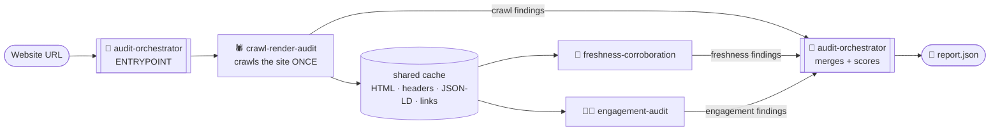
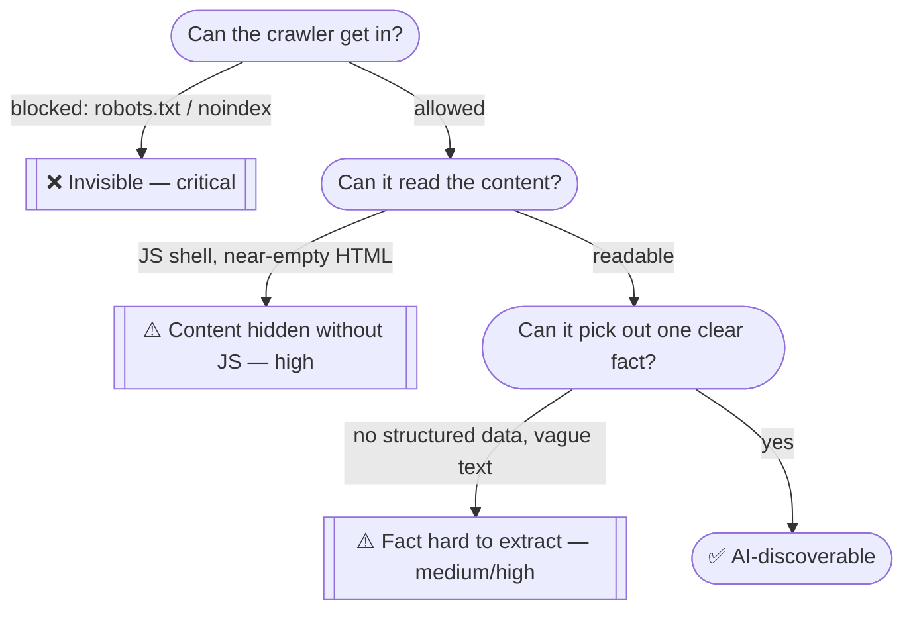

# 🔎 brand-ai-readiness-audit

**An Agent Skill Marketplace that answers one question: will an AI assistant find this brand, trust it, and keep the visitor once they arrive?**

Give it a URL. It crawls the site, checks it against the two things that make or break AI visibility, and hands back one clean report — every problem backed by evidence, scored by severity, and paired with a fix.

| Half of the problem | Question it answers |
|---|---|
| 🤖 **Off-site discoverability** | Can an AI assistant even find and cite this brand? |
| 🖐️ **On-site engagement** | Once a visitor lands here, do they stay? |

---

## 🚀 Quick start

**1. 🧪 Create a virtual environment**

macOS / Linux:
```bash
python3 -m venv venv
```

Windows (Command Prompt or PowerShell):
```bash
python -m venv venv
```

**2. ⚡ Activate it**

macOS / Linux:
```bash
source venv/bin/activate
```

Windows (Command Prompt):
```bash
venv\Scripts\activate.bat
```

Windows (PowerShell):
```bash
venv\Scripts\Activate.ps1
```

**3. 📦 Install dependencies**
```bash
pip install -r requirements.txt
```

**4. ▶️ Run an audit**
```bash
python skills/audit-orchestrator/scripts/run_audit.py --url https://example.com --out report.json --md-out report.md --max-pages 8
```

**5. 🚪 Exit the virtual environment** (when you're done)
```bash
deactivate
```

**Or, as an agent skill:** load this marketplace into an agent, point it at a URL, and ask it to audit the site's AI readiness. The agent invokes `audit-orchestrator`, which runs everything below automatically.

---

## How it's built

One entrypoint skill composes three focused specialists. Each one answers a single question, and only that one:

| Skill | Question it answers | What it checks |
|---|---|---|
| 🧭 **audit-orchestrator** *(entrypoint)* | "What's the final verdict?" | Runs the pipeline, merges every finding into one report, and hands the calling agent a short list of facts to fact-check live |
| 🕷️ **crawl-render-audit** | "Can a crawler get in and actually read this?" | robots.txt / noindex blocks, JavaScript "shell" pages with no real content, missing or broken structured data (JSON-LD), facts trapped inside images or video |
| 📅 **freshness-corroboration** | "Is this fact current, and unambiguous?" | Stale or missing update dates on prices/offers, and whether the brand name is distinguishable from other things sharing the same name |
| 🧑‍💻 **engagement-audit** | "Can a visitor land here and actually stay?" | Missing headings/navigation, no mobile support, heavy pages, blocking popups, no way to find About/Contact |

**How a request flows through the marketplace:**



**File layout:**

```
marketplace.json          → the manifest: lists every skill, marks audit-orchestrator as the entrypoint
skills/
  audit-orchestrator/     → ENTRYPOINT — runs everything, builds the final report
  crawl-render-audit/     → the only skill that touches the network (crawls once, caches the result)
  freshness-corroboration/→ reads the shared cache — freshness + brand-identity checks
  engagement-audit/       → reads the shared cache — visitor-experience checks
```

**Why split it up this way?** Each skill only knows how to do one job, and none of them repeat each other's work. A broken page, for example, is flagged once — by `crawl-render-audit` — and every other skill simply skips it instead of flagging it again. Only `crawl-render-audit` ever touches the network; the other two just read what it already fetched. That keeps a full audit fast (well under the 5-minute limit) and makes each skill's logic easy to test on its own, with no network needed (see [Testing](#testing-without-the-internet) below).

**The logic behind `crawl-render-audit`, in one picture** — a page is only visible to an AI assistant if it clears three gates *in order*, and each gate maps to one category of finding:



**Why fact-checking happens in the orchestrator, not in a script:** confirming a fact against outside sources needs a live web search — something a sandboxed script can't safely do. So `freshness-corroboration` does the part it *can* do reliably (pull out candidate facts worth checking) and hands a short list to the orchestrator. The orchestrator's instructions then tell the calling agent — which does have real search access — to verify the most important ones and add anything it finds to the final report.

---

## What you get back

Every audit produces one JSON report. The contest's required floor is `site`, `audited_at`, a severity-count `summary`, and a `findings` array where each finding has `id`, `title`, `severity`, `evidence`, `suggested_action`. Here's what this implementation actually outputs — note `confidence` is on **every single finding, no exceptions** (it wasn't at first; see the changelog below for why that got fixed):

```json
{
  "site": "example.com",
  "audited_at": "2026-09-20T14:32:00Z",
  "summary": { "total_findings": 6, "critical": 1, "high": 2, "medium": 3, "low": 0 },
  "findings": [
    {
      "id": "F-001",
      "title": "No JSON-LD structured data on product pages",
      "severity": "high",
      "evidence": "Crawled 12 product pages; 0/12 contain schema.org markup.",
      "suggested_action": { "summary": "Add Product/Offer JSON-LD to every product page.", "priority": "high" },
      "confidence": 0.95,
      "source_skill": "crawl-render-audit"
    }
  ]
}
```

On top of that floor, this implementation also adds:
- `confidence` (0–1) on **every** finding — how sure the detector is that the underlying observation is real, separate from whether it's actually a problem
- `source_skill` on every finding — which skill found it
- `methodology` — exactly what was checked (and how), so nothing is assumed
- `limitations` — what *wasn't* verified yet (so "not checked" never looks like "checked and fine")
- `candidate_facts_for_live_corroboration` — facts worth double-checking against outside sources
- a few findings also carry extras where they're useful, e.g. `verification_required` on JS-shell findings, or `page_type` / `impact_confidence` on structured-data findings

---

## Guardrails

- ✅ **Read-only.** No script ever writes to, logs into, or changes the target site — GET requests only.
- ✅ **Respects robots.txt**, every time.
- ✅ **No pre-trained models, no external services** — everything needed to run this marketplace is in this zip.
- ✅ **Built for any website, not one specific site.** Every check looks at a structural signal — how much visible text a page has, whether its JSON-LD parses, whether an alt tag is present — never at a hardcoded site name, industry, or framework. See `skills/*/references/` for the reasoning behind each threshold.

---

## Testing without the internet

Every check script (`check_crawlability.py`, `extract_facts.py`, `check_engagement.py`) can run against a saved cache file instead of the live web:

```bash
python skills/crawl-render-audit/scripts/check_crawlability.py --cache my_test_cache.json --out findings.json
```

That's how the detection logic gets tested — against hand-built or recorded pages — without needing network access.

---

## Bugs we found and fixed along the way

Running this against real sites surfaced a handful of false positives. All are fixed:

- **Sitemaps were being audited like pages.** Some sites (Adobe, for one) publish a sitemap *of sitemaps* — links that point to more sitemap files, not real pages. The crawler used to fetch those as if they were normal HTML, which produced dozens of fake "missing heading" and "missing navigation" findings. It now follows sitemap-of-sitemaps links down to real pages, and double-checks that anything it fetches is actually a webpage before auditing it.
- **Dates were being flagged as phone numbers.** A rough phone-number pattern was matching things like `2026-04-23` from sitemap timestamps. There's now a proper check that rules out dates before accepting anything as a phone number.
- **Valid freshness dates were being missed.** The date parser only understood one date format, so pages with a perfectly good "last updated" header were still marked as having no freshness signal. It now understands the actual format that header uses.
- **The "brand name" pick wasn't stable.** It was chosen from an unordered set, so re-running the audit could pick a different name each time. Fixed to always pick the same one.
- **Some checks ignored data they'd already collected.** The engagement checks gathered every link on the site but only looked for a Contact page among the handful of pages actually crawled — so a real Contact link elsewhere on the site was reported as missing. These checks now look across everything found, not just the pages visited.
- **One bad page could silently kill the whole report.** A single crash used to stop a check entirely with no output — which looked identical to "no problems found." Every check now skips a broken page and keeps going, logging a warning instead of failing silently.
- **Findings weren't all shaped the same way.** One checker forgot to set a confidence score on its findings, while the others always did. Every finding across every skill now carries the same fields, which matters for automated grading.
- **Product pages with plain URLs were mis-classified.** A page like `/mac` doesn't have "product" in its URL, so it was being lumped in with generic content and under-scored on structured-data checks. Classification now also looks at the page's own schema.org type, not just its URL, so this generalizes to any site.
- **The report didn't say what it hadn't checked.** It's now explicit: a `methodology` block says what was and wasn't verified (e.g., JavaScript execution, live fact-checking), so nothing gets silently assumed to be "clean" just because it wasn't tested.
