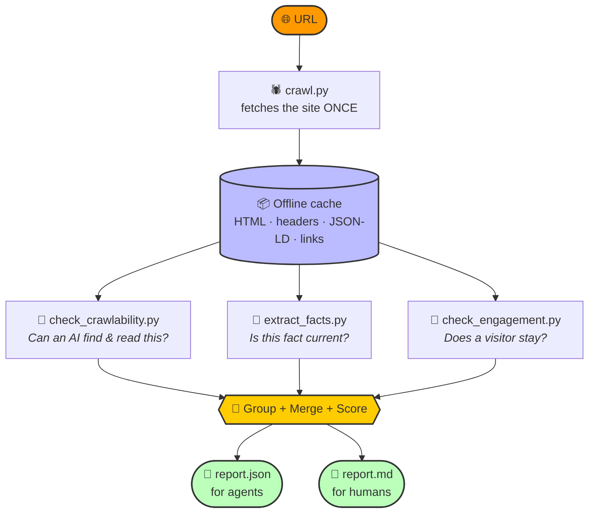
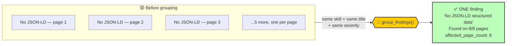

# 🎼 Audit Orchestrator (`run_audit.py`) — The Entrypoint

This is the **command center** of the Brand AI-Readiness Marketplace.

Instead of making an agent (or a human) run four separate scripts by hand, `run_audit.py` runs the whole pipeline with **one command**: crawl the site once, run every check against that single crawl, clean up and merge the results, and hand back one tidy report.

It's **read-only** (GET requests only), **fast** (well under typical time limits), and **crash-proof** (one broken check never takes down the whole report).

---

## 🗺️ How it works



**Why crawl only once?** All three checks need the same raw page data. Crawling once and letting every check read from a shared offline cache keeps the whole audit fast and means the target site only ever sees one polite pass of GET requests.

---

## 🧭 The 4 steps, in plain words

| Step | What happens |
|---|---|
| **1. 🕷️ Crawl** | Visits the URL, respects `robots.txt`, and saves everything useful (HTML, headers, JSON-LD, links) into a temporary offline cache. Nothing else touches the network from here on. |
| **2. 🧪 Check** | Each specialist skill reads that same cache and produces its own list of findings — completely offline, so this step is near-instant. |
| **3. 🧹 Group & merge** | Every check tends to report the *same* problem once per page — e.g. "no JSON-LD" on all 8 pages of a site becomes 8 near-identical findings. This step collapses those into **one** finding per real issue, with a page count and sample URLs attached, instead of drowning the report in repeats. |
| **4. 📊 Assemble** | Sorts what's left by severity (critical → low), renumbers everything (`F-001`, `F-002`, ...), builds the summary counts, and writes both `report.json` (for an agent) and an optional `report.md` (for a human). |

---

## 🧹 The noise-reduction step, explained

This is the part that keeps a report **readable** instead of a wall of duplicates.

**The problem:** if a site is missing meta descriptions on all 8 of its pages, the naive approach reports that 8 separate times — same title, same fix, same everything except the URL. A person skimming the report sees "42 problems" when there are really only a handful of *distinct* issues.

**The fix — `group_findings()`:**



1. **🔑 Same signature = same group.** Findings are grouped by `(which skill found it, its title, its severity)`. Severity is deliberately part of the key — the *same* issue can be more serious on a product page than on a legal page, and merging across severities would quietly erase that difference.
2. **🔗 Pulling the URL out for free.** Every per-page finding already carries its page's URL tucked inside an internal `local_id` (e.g. `CR-NO-JSONLD-https://example.com/x`). `extract_url()` just reads it back out — no other script had to change to make grouping possible.
3. **✍️ Rewriting the evidence.** Instead of "URL X has no H1", a grouped finding reads:
   > *"Found on 8/8 crawled pages, including `https://a` and `https://b`, and 6 other page(s)."*

   One instance is left exactly as-is — there's nothing to summarize about a problem that only happened once.
4. **📎 Everything you'd want stays attached.** Each grouped finding also gets:
   - `affected_page_count` — the true total, always accurate even if the sample list is capped
   - `affected_pages` — up to 25 sample URLs, so nothing enormous bloats the file
   - `confidence` / `impact_confidence` — averaged across every instance in the group
   - `page_type` — becomes a list if the issue showed up on more than one type of page

**The payoff:** a real audit of a mid-sized site went from **42 findings down to 8** — same coverage, same evidence, none of the repetition.

---

## 🚀 How to run it

**Basic run:**
```bash
python run_audit.py --url https://www.example.com
```
*(Writes `report.json` to your current directory.)*

**Deeper crawl + human-readable report:**
```bash
python run_audit.py --url https://www.example.com --max-pages 10 --md-out report.md
```

| Flag | Meaning | Default |
|---|---|---|
| `--url` | Site to audit | *required* |
| `--out` | Where to write the JSON report | `report.json` |
| `--md-out` | Also write a Markdown report here | *(off by default)* |
| `--max-pages` | Crawl budget | `8` |
| `--timeout` | Per-step timeout, in seconds | `180` |

---

## 🏆 Why it's built this way

- **🧩 Separation of concerns** — each checker only knows how to find its own kind of problem. Only the orchestrator knows how to merge them.
- **🧹 Signal over noise** — the grouping step means "number of findings" actually means "number of distinct issues," not "number of pages times number of issues."
- **🛡️ Crash-proof** — if one sub-check produces nothing (crash, timeout, bad page), the orchestrator logs a warning and still builds the final report from whatever succeeded.
- **🤝 Honest about its limits** — the report always ships with a `methodology` block (what was checked, and how) and a `limitations` list, so "not checked" never quietly reads as "checked and fine."
- **🔍 Hands off what it can't verify** — anything that needs a *live* internet search (like confirming a price is still current) gets listed under `candidate_facts_for_live_corroboration` for the calling agent to verify, rather than guessed at.
