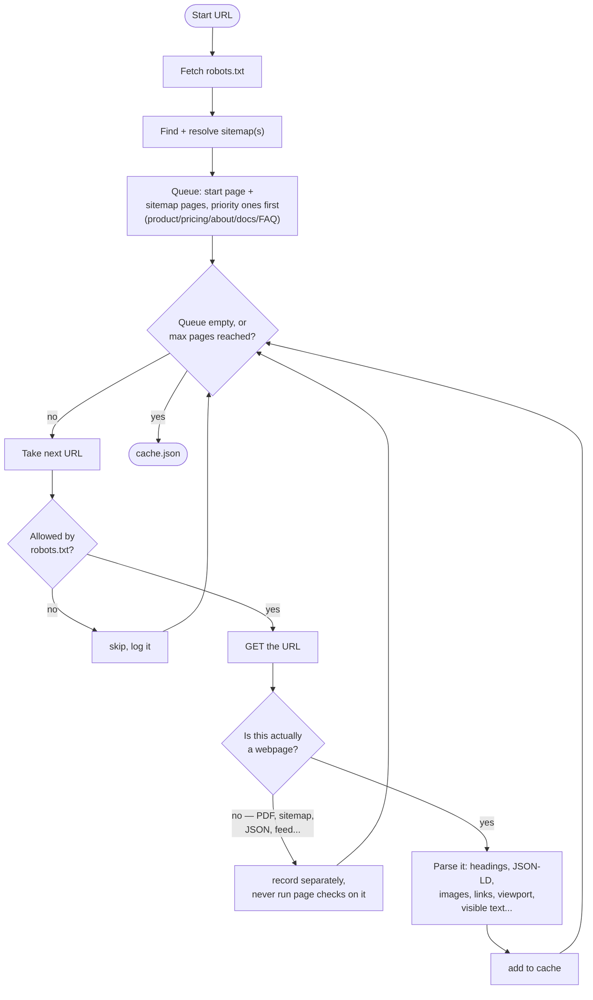
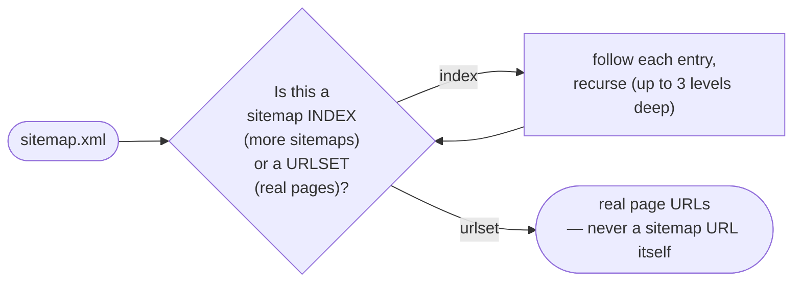
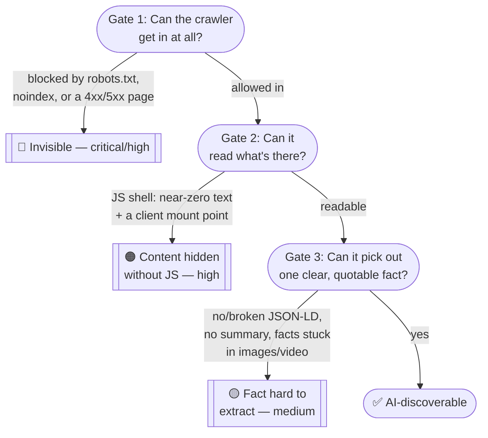
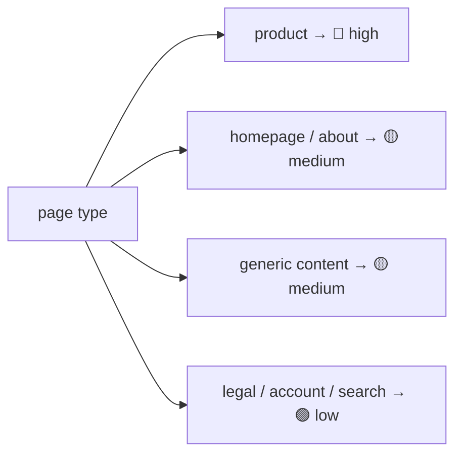
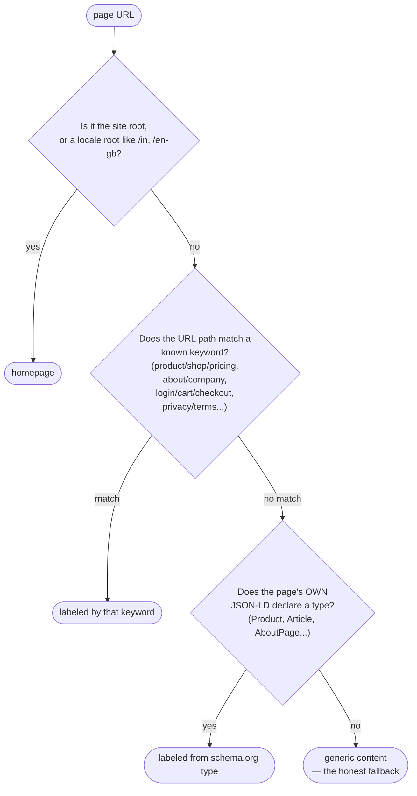

# 🕷️ Crawl & Render Audit

**One-line summary:** before an AI assistant can trust or quote anything on a page, it first has to actually *get to* that page and *read* it. This skill checks that basic chain, in order, and it's the only skill here that talks to the real internet — everyone else just reuses what it found.

Two scripts, two jobs:
- **`crawl.py`** — fetches a bounded, polite set of pages once, and saves everything downstream needs into one cache file
- **`check_crawlability.py`** — reads that cache and turns it into findings

---

## When to use

- As step 1 of a full AI-readiness audit (called automatically by `audit-orchestrator`, which then hands its cache to the other two skills)
- Standalone, when someone asks *"why won't ChatGPT read our site?"* or *"check our crawlability and structured data"*

## Inputs

A URL or domain, and (only when run standalone rather than via the orchestrator) a max-page budget.

## Output

`cache.json` (from `crawl.py`) and `findings.json` (from `check_crawlability.py`):

```json
{
  "skill": "crawl-render-audit",
  "generated_at": "2026-09-20T14:32:00Z",
  "findings": [ /* shared shape: title, severity, evidence, suggested_action, confidence */ ]
}
```

`audit-orchestrator` merges and renumbers findings from every skill, so IDs are never assigned here.

---

## Part 1 — `crawl.py`: fetch once, share with everyone



**Why sniff "is this actually a webpage?" before parsing it:** some sites publish a sitemap *of sitemaps* — a file whose entries point to more sitemap files, not real pages. An earlier version of this crawler queued those links as if they were ordinary pages, which meant raw sitemap XML got run through the H1/nav/viewport checks and produced dozens of fake "missing heading" findings. Now, sitemap links get followed recursively until they resolve to real pages (see the diagram below), and separately, *every* fetched response — however it was reached — gets its content sniffed before anything treats it like a webpage.



**Politeness, by construction, not by promise:** only `GET`/`HEAD` requests, `robots.txt` is always checked before fetching, no forms are ever submitted, nothing is ever written back to the site, and both the page budget and the sitemap-fetch budget are hard caps — so a run can't accidentally hammer a huge site or spiral into an infinite sitemap recursion.

---

## Part 2 — `check_crawlability.py`: three gates, in order

A page a human sees perfectly well can still be *completely invisible* to an AI assistant. This script checks the three things that have to succeed, one after another, for a page to count as AI-discoverable at all:



Each gate maps to a concrete, measurable signal — never a guess:

### Gate 1 — Getting in
| Signal | What it means |
|---|---|
| `robots.txt` blocks a linked/sitemapped page | 🔴 High — a page a human can navigate to is invisible to crawlers |
| `noindex` meta tag or `X-Robots-Tag` header | 🔴 Critical — the site is explicitly telling crawlers to skip this page |
| Page returns 4xx/5xx | 🔴 High/Medium — a broken link is a dead end for both visitors and crawlers |
| No `sitemap.xml` findable | 🟡 Medium — crawlers fall back to slower link-discovery alone |

### Gate 2 — Reading it
A page's raw HTML is measured for how much of it is actually readable text versus markup (`visible text ÷ total HTML size`). If that ratio collapses toward zero **and** the page has a tell-tale client-side mount point (`id="root"`, `"app"`, `"__next"`), that's a strong sign the real content only shows up after JavaScript runs — which a plain-HTML crawler never sees.

This is measured directly, not guessed from a URL or a framework name, so it works on any site — known framework or not.

> ⚠️ **Important honesty check:** this crawler never runs JavaScript, so a thin-looking page is flagged as "*likely* a JS shell, unconfirmed" — not "*confirmed* broken." The finding explicitly says so and asks for a browser-rendered comparison before anyone treats it as certain. A real app shell that hydrates perfectly fine shouldn't be reported with false confidence just because a plain HTTP fetch can't see past it.

### Gate 3 — Picking out a fact
| Signal | What it means |
|---|---|
| Zero `<script type="application/ld+json">` blocks | Detected with certainty; **how much it matters depends on the page type** (see below) |
| A JSON-LD block exists but fails to parse | 🟡 Medium — a parse error is functionally identical to having none at all |
| No meta description / `og:description` | 🟢 Low — assistants often lean on this as a ready-made quotable summary |
| Most images (3+) have no `alt` text | 🟡 Medium — any fact that lives only inside a picture is invisible to a text reader |
| A video with almost no surrounding text | 🟡 Medium — nothing duplicates the video's claims anywhere readable |

**Missing JSON-LD isn't equally serious everywhere** — a product page with no structured data is a much bigger problem than a legal/privacy page with none:



---

## How a page gets its type

Severity for Gate 3 depends on knowing what *kind* of page this is — and that classification has to work on sites this was never tested on, not just the ones it was built against.



**Why the JSON-LD fallback matters:** a real product page at a URL like `/mac` has no "product"/"shop"/"pricing" keyword in it at all — URL matching alone would silently bucket it as generic content and understate how much its missing structured data actually matters. Checking the page's own declared schema type first (before giving up and calling it "content") catches exactly the pages a keyword list can't anticipate — and it's a structural signal, not a per-site keyword, so it works on sites this was never tuned against.

**One more classification detail worth knowing:** the very first page crawled is *not* automatically assumed to be the homepage. Auditing `example.com/store` starts the crawl at `/store` — but `/store` is a store listing, not the homepage, and treating "first page visited" as "the homepage" would throw off severity for exactly the page most likely to matter.

---

## Procedure

```bash
# 1. Crawl and cache (the only network-touching step in the whole marketplace)
python scripts/crawl.py --url "<url>" --out cache.json --max-pages 8

# 2. Check the cache
python scripts/check_crawlability.py --cache cache.json --out findings.json
```

Read `findings.json` — every entry already has `title`, `severity`, `evidence`, `suggested_action`, and `confidence`.

---

## Why this generalizes to sites we've never seen

- The JS-shell check is a **measured ratio**, not a check for any specific framework's name or bundle signature
- JSON-LD is **parsed**, not detected by a shallow regex — so a block that merely *looks* present but is malformed gets caught too
- Page-type classification falls back to the page's **own declared schema type** rather than a fixed, necessarily-incomplete URL keyword list
- Every threshold (text-to-HTML ratio, thin-content character count, alt-text ratio) is a **structural property**, measurable on any HTML document regardless of industry or tech stack

No test site is ever referenced by name in the detection logic itself. See `references/detection-rationale.md` for the full reasoning behind each threshold, useful if you ever need to tune one for an unusual site (e.g. one that's legitimately mostly images).
