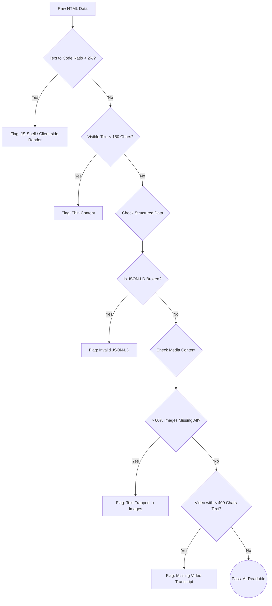

# 🧠 Detection Rationale: How We Evaluate AI Visibility

This document explains the simple, logical rules our audit tool uses to decide if an AI assistant (like ChatGPT or Claude) can actually "see" and understand a website. We look at the underlying structure of the page, not just the visual design.

## 🗺️ The Evaluation Flow

Here is how our auditor processes the raw page data to flag issues:

## 🔍 The Rules in Simple Words

### 🪹 The JS-Shell Trap (2% Text Ratio)
**The Rule:** If readable text makes up less than 2% of the total HTML code, we flag it.
**Why:** Many modern websites (like React or Next.js apps) load a blank "skeleton" first, then use JavaScript to fill in the text. Many AI bots only read the initial HTML and do not run JavaScript. If the text ratio is tiny, the AI is likely staring at a blank wall.

### 🤏 Thin Content (< 150 Characters)
**The Rule:** If a page has fewer than 150 characters of visible text, we flag it.
**Why:** 150 characters is about the length of a single short sentence. Below this limit, there is essentially nothing for an AI assistant to extract, learn, or quote. To the bot, it is an empty room.

### 🧩 Fake or Broken Structured Data (JSON-LD)
**The Rule:** We don't just look for a data tag; we actively try to read it. If the data has syntax errors, we flag it as severely as if it were missing.
**Why:** Structured data (JSON-LD) is how websites hand feed facts to search engines. If the code is broken, AI systems will silently throw it away and ignore the facts entirely.

### 🖼️ Trapped in an Image (60% Missing Alt Text)
**The Rule:** If a page has at least 3 images, and over 60% of them are missing descriptive "alt" text, we flag it.
**Why:** A missing icon is fine. But if most images lack text descriptions, the site is likely relying on images to show critical data (like pricing tables, event flyers, or spec sheets). AI bots read text, not pixels. If facts are trapped in a picture, the AI cannot see them.

### 🎬 Mute Videos (< 400 Characters of Context)
**The Rule:** If a page features a video but has less than 400 characters of surrounding text, we flag it.
**Why:** AI assistants cannot "watch" videos. If a video explains a product but there is no written transcript or summary nearby, all the claims and facts in that video are completely invisible to the AI.

---

### 🧠 Why This Works Everywhere
We don't use arbitrary keywords or try to guess the website's framework. By measuring simple, structural truths—text density, valid code, and readable media—our tool can accurately evaluate *any* unseen website on the internet.