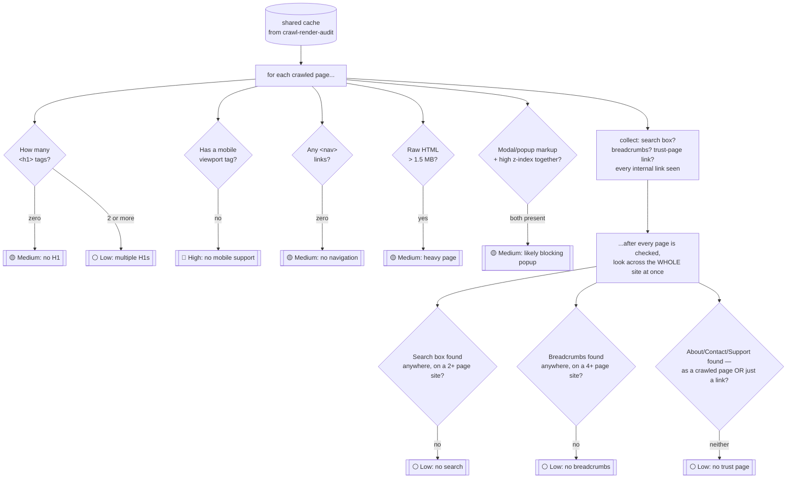
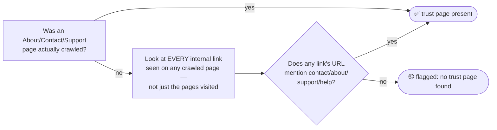

# 🧑‍💻 Engagement Audit

**One-line summary:** getting found is only half the job. This skill checks what happens *after* someone arrives — can they tell what the page is, find their way around, and actually stay?

This is the on-site half of the audit. It has nothing to do with whether an AI assistant can find or cite the brand (that's `crawl-render-audit`'s job) — it's purely about what a real visitor (human, or an AI browsing agent acting on one's behalf) experiences once they land on the page.

---

## When to use

- As the last step of a full AI-readiness audit (called automatically by `audit-orchestrator`)
- Standalone, when someone asks *"why do people bounce off our site?"* or *"review our on-site experience"*

## Inputs

The JSON cache produced by `crawl-render-audit/scripts/crawl.py`, passed via `--cache`. This skill never crawls the site itself — it just reads what's already been fetched.

## Output

One `findings.json` file:

```json
{
  "skill": "engagement-audit",
  "generated_at": "2026-09-20T14:32:00Z",
  "findings": [ /* shared shape: title, severity, evidence, suggested_action, confidence */ ]
}
```

`audit-orchestrator` merges and renumbers findings from every skill, so IDs are never assigned here.

---

## How it thinks — the pipeline



**Why some checks happen per-page and others happen only once, at the end:** a heading or a viewport tag is a property of *one specific page* — flag it there. But "does this site have a search box at all?" isn't something any single page can answer on its own; some sites only put search on the homepage, others bury it in a header on every page. So those three checks (search, breadcrumbs, trust page) wait until every page has been looked at, then ask the question once, across everything collected.

---

## What it checks, in plain terms

| Check | Why it matters | Severity |
|---|---|---|
| **No H1 heading** | The first thing a visitor (or an assistant summarizing the page) uses to understand what a page is about | 🟡 Medium |
| **Multiple H1 headings** | Muddies which topic is actually the main one | ⚪ Low |
| **No mobile viewport tag** | Without it, phones render a zoomed-out desktop layout — a well-documented, high-impact bounce cause | 🔴 High |
| **No navigation links** | A visitor with no way to explore further tends to just leave | 🟡 Medium |
| **Unusually heavy page (&gt;1.5MB HTML)** | A proxy for render-blocking bloat that delays the point where there's anything to see | 🟡 Medium |
| **Likely blocking popup on load** | An immediate, hard-to-dismiss overlay is a classic instant-bounce cause | 🟡 Medium |
| **No on-site search** *(2+ page sites only)* | Visitors who can't quickly find the one thing they came for tend to leave | ⚪ Low |
| **No breadcrumbs** *(4+ page sites only)* | Without them, visitors lose track of where they are as a site gets deeper | ⚪ Low |
| **No About/Contact/Support page found** | A well-documented driver of visitor hesitation, and of an assistant's hesitation to recommend the brand | ⚪ Low |

A couple of these are deliberately conservative, on purpose:

- **The blocking-popup check needs *two* signals together** (popup-style markup *and* a very high `z-index` style), not just one. A site that uses a modal for something genuinely optional — like a video lightbox — shouldn't get flagged just for having modal markup at all.
- **Search and breadcrumbs are only expected on sites big enough to need them.** A 2-page brochure site doesn't need a search box, and a 3-page site doesn't need breadcrumbs — so those checks simply don't fire below that size, rather than penalizing small sites for not having features they don't need.

### The trust-page check looks further than just the pages it crawled



This matters because a real Contact link sitting in the footer — but outside the handful of pages this audit actually had budget to crawl — is still a page a real visitor *can* reach. Checking only the pages that were fetched would have reported it as missing even though it's right there in the nav.

**Findings that overlap with crawlability are deliberately not repeated here.** A page that returns a 404, for example, is `crawl-render-audit`'s finding to raise — this skill skips it entirely (rather than also flagging "no H1" on a page that doesn't really exist), so severity counts stay meaningful instead of padded with duplicates.

---

## Procedure

```bash
python scripts/check_engagement.py --cache cache.json --out findings.json
```

Read `findings.json` — every entry already has `title`, `severity`, `evidence`, `suggested_action`, and `confidence`.

---

## Why this generalizes to sites we've never seen

Every check here measures a structural property — element counts, byte sizes, URL patterns — never a specific site, industry, or framework:

- "heavy page" is a byte threshold, not a name of any particular framework's bundle
- "trust page" detection is keyword-based (`contact`, `about`, `support`, `help`) and works on any URL scheme
- the search/breadcrumb thresholds scale with how many pages the site actually has, so a tiny site and a huge one are each judged by a bar that makes sense for their size

No test site is ever referenced by name in the detection logic itself.
