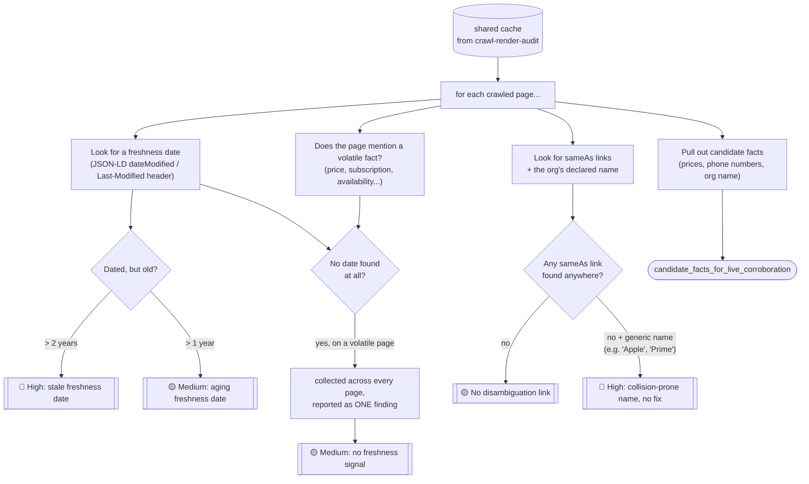
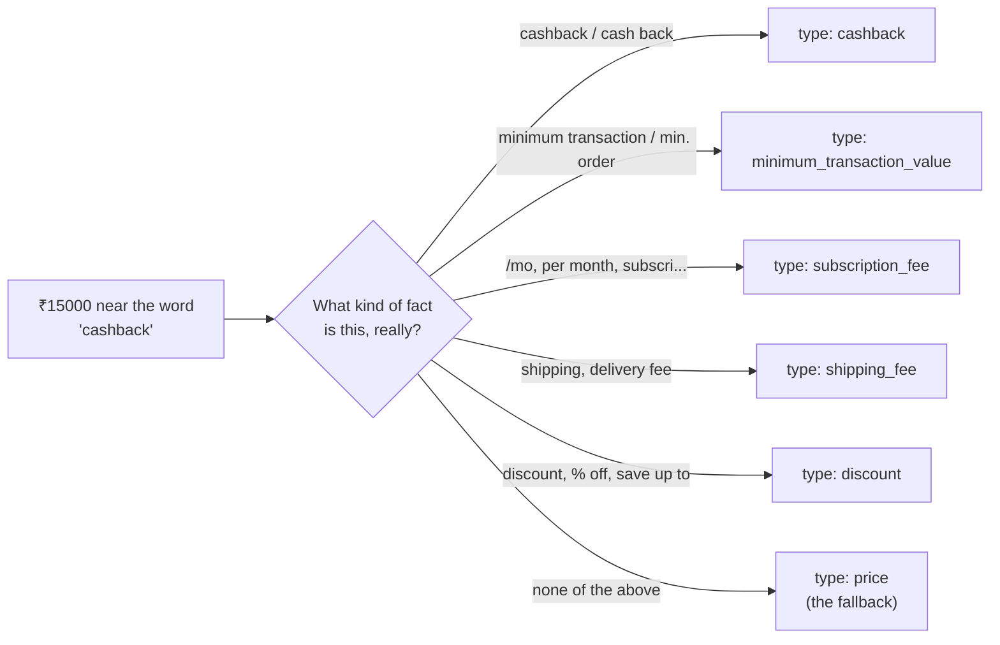
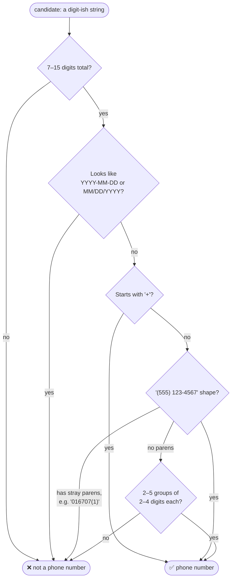

# 📅 Freshness & Corroboration Audit

**One-line summary:** a fact an AI can't date, and a brand name an AI can't tell apart from others, are both facts an AI will eventually get wrong. This skill catches both, and flags exactly which facts are worth double-checking.

This is the third of the two things machines need before they'll trust and repeat something (see Round-2 appendix, section D): **is it current, and is it unambiguous?** `crawl-render-audit` already made sure the content is reachable — this skill assumes that part is done and focuses purely on trust.

---

## When to use

- As step 3 of a full AI-readiness audit (called automatically by `audit-orchestrator`)
- Standalone, when someone asks *"why does ChatGPT/Perplexity quote our old pricing?"* or *"why does the AI think we're a different company with the same name?"*

## Inputs

The JSON cache produced by `crawl-render-audit/scripts/crawl.py`, passed via `--cache`. This skill never crawls the site itself — reusing the shared cache keeps the whole audit fast and lets this skill's logic be tested completely offline.

## Output

One `findings.json` file:

```json
{
  "skill": "freshness-corroboration",
  "generated_at": "2026-09-20T14:32:00Z",
  "findings": [ /* shared shape: title, severity, evidence, suggested_action, confidence */ ],
  "candidate_facts_for_live_corroboration": [ /* org name, prices, phone numbers */ ]
}
```

`audit-orchestrator` merges and renumbers findings from every skill, so IDs are never assigned here.

---

## How it thinks — the pipeline



**Why "no freshness signal" is one finding, not one per page:** a 7-page site missing a `dateModified` field on every product page is one systemic gap, not seven separate problems. Reporting it seven times just makes the report noisier without adding information — so every affected page is listed as evidence *inside* a single aggregated finding instead.

---

## What it checks, in plain terms

### 1. Is the fact current?
A price or offer that nobody can date is a fact an assistant can't safely repeat — it might be six months stale. This skill looks for two signals: a `dateModified`/`datePublished` field in the page's JSON-LD, or the HTTP `Last-Modified` header. It only cares about this on pages that actually look **time-sensitive** — mentions a price, a subscription fee, "in stock", "% off", and so on. A static "Our mission" page not having a fresh timestamp isn't a problem; a pricing page with no way to tell if it's current is.

| Situation | Result |
|---|---|
| Freshness date found, and it's recent | ✅ no finding |
| Freshness date found, but it's 1–2 years old | 🟡 medium — "aging" |
| Freshness date found, but it's 2+ years old | 🔴 high — "stale" |
| No freshness date anywhere, page is time-sensitive | 🟡 medium — aggregated across all such pages |

A quick, cheap bonus check: an outdated **copyright year** in the footer (2+ years behind today) is a small but easy-to-spot sign of an unmaintained site.

### 2. Is the brand unambiguous?
If ten different companies are named "Apple," an assistant needs a way to know which one this page is about. The clearest machine-readable signal for that is a **`sameAs`** link on the page's Organization schema, pointing to Wikidata, Wikipedia, LinkedIn, Crunchbase, or an official social profile.

- No `sameAs` link anywhere → flagged (low/medium, depending on how collision-prone the name is)
- No `sameAs` link **and** the brand name is a common English word (like "Apple" or "Prime") → escalated to **high** — this is exactly the combination where an assistant is most likely to answer about the wrong company entirely

### 3. What facts are worth double-checking?
This skill can tell *what* a fact is, but not whether it's *true* — that needs a live web search, which only the calling agent can safely do (see Procedure, step 2). So it hands over a short, labeled list instead of a bare number:



A cashback offer and a product's actual price need to be corroborated differently — mislabeling one as the other would send the agent to fact-check the wrong claim. The classifier looks only at the *sentence containing the number*, not a fixed character window on either side, so a cashback mention in the next sentence over can't accidentally get attached to an unrelated price.

Phone numbers get the same "don't guess" treatment — a rough pattern first grabs anything digit-shaped, and a stricter check then throws out anything that's actually a date, an order ID, or a footnote marker before it's accepted as a real phone number:



That last "stray parens" case is a real one: `016707(1)` and `016707(14)` are footnote markers sitting next to a number, not an area code — the old, looser check couldn't tell the difference.

---

## Procedure

**1. Run the deterministic checks:**
```bash
python scripts/extract_facts.py --cache cache.json --out findings.json
```
This produces both `findings` (the freshness/disambiguation problems above) and `candidate_facts_for_live_corroboration` — a short, labeled list of facts worth checking further.

**2. Fact-check the top candidates (only if a search tool is available):**
This is the one step in the whole marketplace that genuinely needs live web access, and it can only be done by the calling agent — a sandboxed script can't reliably reach arbitrary outside sites. Pick up to 3 of the most consequential candidates (prices and identity claims first), and search for independent confirmation from sources that are **not** the brand's own site or its own social accounts. If a fact can't be found anywhere independent, or is contradicted, add a finding in the same shape as the others (see `audit-orchestrator/SKILL.md`, step 3, for exactly how to append it). If no search tool is available, skip this step — the deterministic findings on their own are still complete and valid.

---

## Why this generalizes to sites we've never seen

Every rule here is a structural pattern, not a fact about one specific brand:
- "time-sensitive" is decided by *language* (price/subscription/availability keywords), never by a hardcoded product or company name
- the generic-name list (`apple`, `prime`, `spark`, `edge`, ...) is about **collision risk from common English words**, not about any one company
- the phone/date/fact-type logic is pure string-shape reasoning — it works identically on a bakery's contact page or a bank's pricing page

No test site, industry, or framework is ever referenced by name in the detection logic itself.
